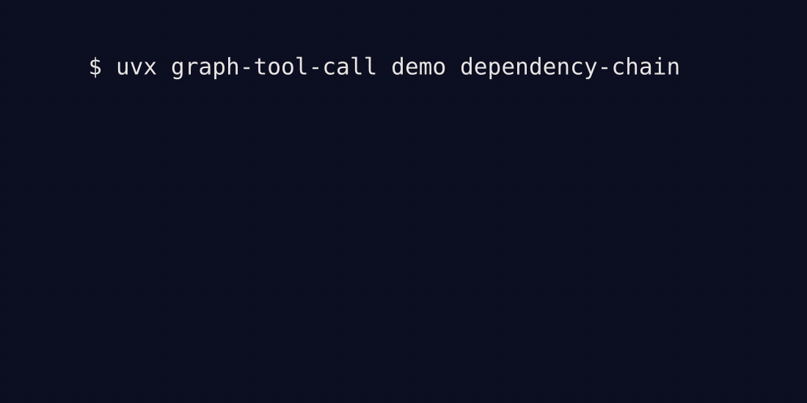

<div align="center">

# graph-tool-call

**LLM 에이전트는 수천 개의 tool 정의를 컨텍스트에 담을 수 없다.**<br>
벡터 검색은 *유사한* tool은 찾지만, 그들이 속한 *워크플로*는 놓친다.<br>
**graph-tool-call**은 tool 그래프를 구축하고 — 단일 매칭이 아닌 — 올바른 체인을 찾아온다.

<br>

| 7-case commerce 회귀 검증 | Target only | graph-tool-call |
|---|:---:|:---:|
| **필수 producer recall** | 14.3% | **100%** |
| **후보 plan coverage** | 47.6% | **100%** |
| **Target Recall@5** | - | **100%** |

<sub>모델을 사용하지 않는 deterministic engine benchmark. <a href="https://github.com/SonAIengine/graph-tool-call/blob/v0.36.0/benchmarks/results/releases/v0.36.0/dependency-chain-evidence.json">Case별 원본 증거</a>와 <a href="docs/benchmarks.md">전체 방법론</a>.</sub>

<br>



<br>

[](https://pypi.org/project/graph-tool-call/)
[](https://sonaiengine.github.io/graph-tool-call/)
[](https://opensource.org/licenses/MIT)
[](https://www.python.org/downloads/)
[](https://github.com/SonAIengine/graph-tool-call/actions/workflows/ci.yml)
[](https://pypi.org/project/graph-tool-call/)

[English](README.md) · 한국어 · [中文](README-zh_CN.md) · [日本語](README-ja.md)

</div>

---

<details>
<summary><b>목차</b></summary>

- [왜 필요한가](#왜-필요한가)
- [동작 원리](#동작-원리)
- [Installation](#installation)
- [Quick Start](#quick-start)
- [통합 패턴 고르기](#통합-패턴-고르기)
- [벤치마크](#벤치마크)
- [Advanced Features](#advanced-features)
- [Documentation](#documentation)
- [Contributing](#contributing)

</details>

---

## 왜 필요한가

LLM 에이전트는 tool이 필요하다. 하지만 tool 개수가 늘면 두 가지가 무너진다.

1. **컨텍스트 오버플로** — 대형 catalog는 현재 요청에 필요하지 않은 tool로 모델 context를 소모한다.
2. **Target-only 검색은 선행 도구를 놓친다** — *"주문 환불"*을 검색하면 `refundOrder`는 찾지만 이 tool에는 `order_id`가 필요하다. 실행 가능한 흐름은 그 ID를 만드는 tool부터 시작한다.

**graph-tool-call**은 둘 다 해결한다. tool 관계를 그래프로 모델링하고, 하이브리드 검색(BM25 + 그래프 탐색 + 임베딩 + MCP annotation)으로 멀티스텝 워크플로를 검색하며, 명시적인 planner 토큰 예산에 맞는 schema만 선별한다.

| 시나리오 | Vector-only | graph-tool-call |
|----------|------------|-----------------|
| *"내 주문 환불"* | `refundOrder` 반환 | typed contract 근거로 `findOrdersByEmail` + `refundOrder` |
| *"파일 읽고 저장"* | `read_file` 반환 | `read_file` + `write_file` (COMPLEMENTARY 관계) |
| *"오래된 레코드 삭제"* | "delete" 매칭 tool 아무거나 | MCP annotation으로 destructive tool 우선 |
| *"이제 그거 취소해"* (이전에 listing 함) | history 컨텍스트 없음 | 사용한 tool 강등, 다음 단계 tool 부스트 |
| 여러 Swagger spec에 중복 tool | 결과에 중복 노출 | cross-source 자동 dedupe |
| 1,200 API 엔드포인트 | 느리고 노이즈 많음 | 카테고리화 + 그래프 탐색으로 정밀 검색 |

---

## 동작 원리

```text
OpenAPI / MCP / Python 함수 → Ingest → Tool 그래프 빌드 → Hybrid 검색 → Agent
```

**예시** — 사용자가 *"내 주문 취소하고 환불 처리해줘"*라고 한다.

벡터 검색은 `cancelOrder`를 찾는다. 하지만 실제 워크플로는 이렇다:

```text
                    ┌──────────┐
          PRECEDES  │listOrders│  PRECEDES
         ┌─────────┤          ├──────────┐
         ▼         └──────────┘          ▼
   ┌──────────┐                    ┌───────────┐
   │ getOrder │                    │cancelOrder│
   └──────────┘                    └─────┬─────┘
                                        │ COMPLEMENTARY
                                        ▼
                                 ┌──────────────┐
                                 │processRefund │
                                 └──────────────┘
```

graph-tool-call은 tool 하나가 아니라 체인 전체를 반환한다. 검색은 **weighted Reciprocal Rank Fusion (wRRF)**로 4가지 신호를 결합한다.

* **BM25** — 키워드 매칭
* **그래프 탐색** — 관계 기반 확장 (PRECEDES, REQUIRES, COMPLEMENTARY)
* **임베딩 유사도** — semantic 검색 (선택, 어떤 provider든)
* **MCP annotation** — read-only / destructive / idempotent 힌트

---

## Installation

코어 패키지는 **의존성 0** — Python 표준 라이브러리만 사용. 필요한 것만 골라 설치하면 된다.

```bash
pip install graph-tool-call                # core (BM25 + graph) — 의존성 없음
pip install graph-tool-call[embedding]     # + 임베딩, cross-encoder reranker
pip install graph-tool-call[openapi]       # + OpenAPI YAML 지원
pip install graph-tool-call[mcp]           # + MCP server / proxy 모드
pip install graph-tool-call[all]           # 전부
```

<details>
<summary>전체 extras</summary>

| Extra | 설치 | 사용 시기 |
|-------|----------|-------------|
| `openapi` | pyyaml | YAML OpenAPI spec |
| `embedding` | numpy | semantic 검색 (Ollama/OpenAI/vLLM 연동) |
| `embedding-local` | numpy, sentence-transformers | 로컬 sentence-transformers 모델 |
| `similarity` | rapidfuzz | 중복 탐지 |
| `langchain` | langchain-core | LangChain 통합 |
| `visualization` | pyvis, networkx | HTML graph export, GraphML |
| `dashboard` | dash, dash-cytoscape | 인터랙티브 대시보드 |
| `lint` | ai-api-lint | 망가진 API spec 자동 수정 |
| `mcp` | mcp | MCP server / proxy 모드 |

</details>

---

## Quick Start

### 30초 안에 시도 (설치 없이)

```bash
uvx graph-tool-call demo dependency-chain
```

```text
Query: "Refund the order for alice@example.com"

Selected target:
  refundOrder(order_id)

Required producer:
  findOrdersByEmail(email) -> order_id
  evidence: api_contract, openapi_link

Execution order:
  1. findOrdersByEmail
  2. refundOrder
```

### Python API

```python
from graph_tool_call import ToolGraph

# Petstore API에서 tool 그래프 빌드
tg = ToolGraph.from_url(
    "https://petstore3.swagger.io/api/v3/openapi.json",
    cache="petstore.json",
)
print(tg)
# → ToolGraph(tools=19, nodes=22, edges=100)

# Tool 검색
tools = tg.retrieve("create a new pet", top_k=5)
for t in tools:
    print(f"{t.name}: {t.description}")

# 워크플로 가이드 포함 검색
results = tg.retrieve_with_scores("process an order", top_k=5)
for r in results:
    print(f"{r.tool.name} [{r.confidence}]")
    for rel in r.relations:
        print(f"  → {rel.hint}")

# OpenAPI tool 직접 실행
result = tg.execute(
    "addPet", {"name": "Buddy", "status": "available"},
    base_url="https://petstore3.swagger.io/api/v3",
)
```

### Workflow planning

`plan_workflow()`은 prerequisite을 포함한 순서 있는 실행 체인을 반환 — 에이전트 round-trip을 3-4회에서 1회로 줄인다.

```python
plan = tg.plan_workflow("process a refund")
for step in plan.steps:
    print(f"{step.order}. {step.tool.name} — {step.reason}")
# 1. getOrder      — prerequisite for requestRefund
# 2. requestRefund — primary action

plan.save("refund_workflow.json")
```

워크플로 편집, 파라미터 매핑, 시각화 → [Direct API 가이드](docs/integrations/direct-api.md#workflow-planning) 참조.

### 다른 tool 소스

```python
# MCP server에서 (HTTP JSON-RPC tools/list)
tg.ingest_mcp_server("https://mcp.example.com/mcp")

# MCP tool 리스트에서 (annotation 보존)
tg.ingest_mcp_tools(mcp_tools, server_name="filesystem")

# Python 콜러블에서 (type hint + docstring)
tg.ingest_functions([read_file, write_file])
```

MCP annotation (`readOnlyHint`, `destructiveHint`, `idempotentHint`, `openWorldHint`)은 검색 신호로 활용된다 — query intent가 자동 분류되어, read 쿼리는 read-only tool을, delete 쿼리는 destructive tool을 우선한다.

---

## 통합 패턴 고르기

graph-tool-call은 여러 통합 패턴을 제공한다. 본인 스택에 맞는 걸 골라 쓰면 된다.

| 사용 환경 | 패턴 | 토큰 절감 | 가이드 |
|---|---|:---:|---|
| Claude Code / Cursor / Windsurf | **MCP Proxy** (N개 MCP server → 3개 meta-tool) | ~1,200 tok/turn | [docs/integrations/mcp-proxy.md](docs/integrations/mcp-proxy.md) |
| MCP 호환 클라이언트 | **MCP Server** (단일 소스를 MCP로) | 다양 | [docs/integrations/mcp-server.md](docs/integrations/mcp-server.md) |
| LangChain / LangGraph (50+ tools) | **Gateway tools** (N tool → 2 meta-tool) | **92%** | [docs/integrations/langchain.md](docs/integrations/langchain.md) |
| OpenAI / Anthropic SDK (기존 코드) | **Middleware** (1줄 monkey-patch) | 76–91% | [docs/integrations/middleware.md](docs/integrations/middleware.md) |
| 검색 직접 제어 | **Python API** (`retrieve()` + 포맷 어댑터) | 다양 | [docs/integrations/direct-api.md](docs/integrations/direct-api.md) |

### MCP Proxy (가장 흔한 케이스)

여러 MCP server를 쓰면 tool 이름이 매 LLM turn마다 쌓인다. 하나의 server 뒤로 묶어버리자: **172 tools → 3 meta-tools**.

```bash
# 1. ~/backends.json에 MCP server 목록 작성
# 2. Claude Code에 proxy 등록
claude mcp add -s user tool-proxy -- \
  uvx "graph-tool-call[mcp]" proxy --config ~/backends.json
```

전체 셋업, passthrough 모드, remote transport → [MCP Proxy 가이드](docs/integrations/mcp-proxy.md).

### LangChain Gateway

```python
from graph_tool_call.langchain import create_gateway_tools

# Slack, GitHub, Jira, MS365... 62 tools
gateway = create_gateway_tools(all_tools, top_k=10)
# → [search_tools, call_tool] — 컨텍스트엔 2개 tool만

agent = create_react_agent(model=llm, tools=gateway)
```

62개 tool을 다 바인딩하는 것 대비 92% 토큰 절감. auto-filter, manual 패턴은 [LangChain 가이드](docs/integrations/langchain.md) 참조.

### SDK middleware

```python
from graph_tool_call.middleware import patch_openai

patch_openai(client, graph=tg, top_k=5)  # ← 이 한 줄만 추가

# 기존 코드 그대로 — 248개 tool이 들어가지만, 관련된 5개만 전송됨
response = client.chat.completions.create(
    model="gpt-4o",
    tools=all_248_tools,
    messages=messages,
)
```

Anthropic도 `patch_anthropic`으로 동일하게 동작. [Middleware 가이드](docs/integrations/middleware.md) 참조.

---

## 벤치마크

현재 release headline은 모델을 사용하지 않는 7-case commerce 회귀 검증을
기준으로 한다. Target 선택 후 graph expansion이 필요한 producer를 모두
추가하는지를 측정한다.

| Metric | Target only | Graph with producers |
|---|---:|---:|
| 필수 producer recall | 0.1429 | **1.0000** |
| 후보 plan coverage | 0.4762 | **1.0000** |
| 후보 binding support | 0.1429 | **1.0000** |
| 불필요한 expansion case | 0 | **0** |

[Case별 artifact](https://github.com/SonAIengine/graph-tool-call/blob/v0.36.0/benchmarks/results/releases/v0.36.0/dependency-chain-evidence.json)에
fixture hash, 정답 target과 producer, 후보 목록, 지표, 한계와 재현 명령이
포함되어 있다. 과거 model-in-the-loop 결과는 전체 benchmark 문서에 남기되
현재 release headline으로 사용하지 않는다.

→ 전체 결과 (pipeline / retrieval-only / competitive / 1068-scale / 200 tool LangChain agent — GPT, Claude 시리즈): **[docs/benchmarks.md](docs/benchmarks.md)**

```bash
# Release claim 재현
make launch-evidence
make launch-evidence-check
```

---

## Advanced Features

### Embedding 기반 hybrid search

BM25 + 그래프 위에 semantic 검색을 추가. 무거운 의존성 없이 외부 임베딩 server에 연결 가능.

```python
tg.enable_embedding("ollama/qwen3-embedding:0.6b")        # Ollama (권장)
tg.enable_embedding("openai/text-embedding-3-large")      # OpenAI
tg.enable_embedding("vllm/Qwen/Qwen3-Embedding-0.6B")     # vLLM
tg.enable_embedding("sentence-transformers/all-MiniLM-L6-v2")  # 로컬
tg.enable_embedding(lambda texts: my_embed_fn(texts))     # custom callable
```

가중치는 자동 재조정. 모든 provider 형식은 [API 레퍼런스](docs/api-reference.md#embedding-provider-strings) 참조.

### Retrieval 튜닝

```python
tg.enable_reranker()                                      # cross-encoder rerank
tg.enable_diversity(lambda_=0.7)                          # MMR diversity
tg.set_weights(keyword=0.2, graph=0.5, embedding=0.3, annotation=0.2)
```

### History-aware retrieval

이전에 호출한 tool을 넘겨주면 강등시키고 다음 단계 후보를 부스트한다.

```python
tools = tg.retrieve("now cancel it", history=["listOrders", "getOrder"])
# → [cancelOrder, processRefund, ...]
```

### Save / load (임베딩 + 가중치 보존)

```python
tg.save("my_graph.json")
tg = ToolGraph.load("my_graph.json")
# 또는 from_url의 cache= 사용
tg = ToolGraph.from_url(url, cache="my_graph.json")
```

### LLM-enhanced ontology

```python
tg.auto_organize(llm="ollama/qwen2.5:7b")
tg.auto_organize(llm="litellm/claude-sonnet-4-20250514")
tg.auto_organize(llm=openai.OpenAI())
```

더 풍부한 카테고리, 관계, 검색 키워드를 빌드. Ollama, OpenAI client, litellm, 그리고 callable을 지원. [API 레퍼런스](docs/api-reference.md#ontology-llm-inputs) 참조.

### 기타 기능

| 기능 | API | 문서 |
|---|---|---|
| Spec 간 중복 탐지 | `find_duplicates` / `merge_duplicates` | [API ref](docs/api-reference.md#analysis) |
| 충돌 탐지 | `apply_conflicts` | [API ref](docs/api-reference.md#analysis) |
| 운영 분석 | `analyze` | [API ref](docs/api-reference.md#analysis) |
| 인터랙티브 대시보드 | `dashboard()` | [API ref](docs/api-reference.md#export--visualization) |
| HTML / GraphML / Cypher export | `export_html` / `export_graphml` / `export_cypher` | [API ref](docs/api-reference.md#export--visualization) |
| 망가진 OpenAPI spec 자동 수정 | `from_url(url, lint=True)` | [ai-api-lint](https://github.com/SonAIengine/ai-api-lint) |

---

## Documentation

| 문서 | 설명 |
|---|---|
| [CLI 레퍼런스](docs/cli.md) | 모든 `graph-tool-call` CLI 명령 |
| [Python API 레퍼런스](docs/api-reference.md) | `ToolGraph` 메서드, helper, middleware, LangChain |
| [통합 가이드](docs/integrations/) | MCP server / proxy, LangChain, middleware, direct API |
| [벤치마크 결과](docs/benchmarks.md) | 전체 pipeline / retrieval / competitive / scale 표 |
| [Architecture](docs/architecture/overview.md) | 시스템 개요, 파이프라인 레이어, 데이터 모델 |
| [Design notes](docs/design/) | 알고리즘 설계 — normalization, 의존성 탐지, ontology |
| [Research](docs/research/) | 경쟁 분석, API 스케일 데이터 |
| [Release checklist](docs/release-checklist.md) | 릴리스 프로세스, changelog 흐름 |

---

## Contributing

기여를 환영한다.

```bash
git clone https://github.com/SonAIengine/graph-tool-call.git
cd graph-tool-call
pip install poetry pre-commit
poetry install --with dev --all-extras
pre-commit install   # 매 commit 전 ruff 자동 실행

# Test, lint, benchmark
poetry run pytest -v
poetry run ruff check . && poetry run ruff format --check .
python -m benchmarks.run_benchmark -v
```

---

## License

[MIT](LICENSE)
